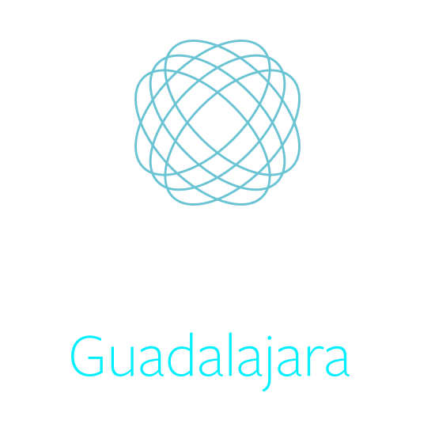

<!-- _class: gaia lead -->

# Termina tu carrera con experiencia profesional

···

Andrés Ávila Acosta

---
<!-- _class: invert -->
# Consiguiendo experiencia
1. Para qué nos sirve
2. Cómo y dónde conseguirla
3. Consejos
4. Consideraciones

---
#  💁‍♂️ Yo

- Lead Software Engineer
- Developer Circles Guadalajara
- Estudiante de Ing. Computación
- 4+ años como desarrollador

<!--  -->

---
<!-- class: invert lead -->
# 🤷‍
## ¿Para qué la necesito?
**Academia** <> **Industria**

---
<!-- _class: invert -->
## En la academia: Lo Bueno 👍
- Enseñansa de fundamentos (matemáticas, física, ...)
- Conocimiento teórico
- Conocimiento general

---
<!-- _class: invert -->
## En la academia: Lo Malo 👎
- Conocimiento atrasado
- Pensamiento cuadrado
- Luchas por calificación, no por conocimiento

---
<!-- _class: invert -->
## En la industria: Lo Bueno 👍
- Herramientas modernas
- Conocimiento útil
- Oportunidades de empleo
- Amplía el panorama

---
<!-- _class: invert -->
## En la industria: Lo Malo 👎
- Conocimientos muy específicos
- Si no estudias, te rezagas

---
# 🤷‍♂️
## ¿Dónde la encuentro?
_...Buscando..._

---
# :robot:
## Programas para estudiantes (Intership)
- IBM
- Intel
- Continental
- HP
- Oracle
- En el extranjero

---
<!-- _class: invert -->
## ✅ Ventajas de programas para estudiantes
- Mayor posibilidad de entrar
- Experiencia corporativa
- Camino seguro
- Adecuado a estudiantes
- Posibilidad de ser cotratado
- Estabilidad laboral

---
<!-- _class: invert -->
## 🚫 Desventajas de programas para estudiantes
- Falsas expectativas
- Especialización en la empresa
- Burocracia

---
# 👽
## Startups
Empresas pequeñas, mentes brillantes

---
<!-- _class: invert -->
## ✅ Ventajas de Startups
- Oportunidades de aprendizaje
- Experiencia multidiciplinaria
- Crecimiento profersional
- Cultura de startup

---
<!-- _class: invert -->
## 🚫 Desventajas de Startups
- Ambientes apresurado
- Aprendes porque aprendes
- Insertidumbre
- Hay malas startups

---
# 🏋️‍♀️
## Bootcamp
- Generation
- Centraal Academy
- Laboratoria

---
<!-- _class: invert -->
## ✅ Ventajas de un Bootcamp
- Te enseñan a usar las herramientas necesarias
- Aprendes mucho en poco Tiempo
- Te guían paso a paso

---
<!-- _class: invert -->
## 🚫 Desventajas de un Bootcamp
- Conocimiento superficial
- Tiene costo

---
# 👨‍💻 👩‍💻
## Hackatones
- Startup Weekend
- Talent Land
- Patrocinados: Facebook, Amazon, Google

---
<!-- _class: invert -->
## ✅ Ventajas de un Hackaton
- Generas un portafolio
- Te contratan o apoyan tu proyecto
- La experiencia de un hackaton

---
<!-- _class: invert -->
## 🚫 Desventajas de un Hackaton
- No es experiencia laboral, pero demuestra conocimientos
- Son cortos
- No todos gana

---
# 🐧
## Proyectos Open Source
Contribuyendo

---
# Mi consejo
¿Qué te gusta hacer?

.

¿A dónde quieres llegar?

.

Genera un plan

---
# ✋
## Cosas a considerar

Antes de que lo hagas...

---
# 🦖
## Tiempo
_¿Ya mero terminas la carrera, mijo?_

---
# 💰
## Dineros
Tal vez no lo suficiente

---
# 🏫
## La escuelita
No la dejen, sí sirve.

---
# 🤷‍♂️
## ¿Y qué más puedo hacer?

---
<!-- _class: invert lead -->

[www.facebook.com/groups/DevCGuadalajara/]([www:///](https://www.facebook.com/groups/DevCGuadalajara/))

---
<!-- _class: invert lead -->
# ¿Preguntas?

---
<!-- _class: invert lead -->
# ¡Gracias!

andaviaco@gmail.com

